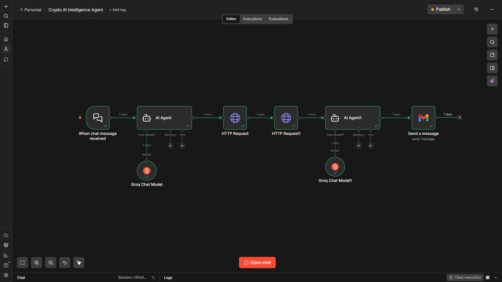

# 🤖 Crypto AI Intelligence Agent - Built with n8n

An automated AI-powered crypto analytics agent that chats with users,
fetches live prices, reads the latest news, generates a professional
AI analytics report, and sends it to your email - all with zero code.


---

## 📸 Demo

> User types "Bitcoin" → Gets a full AI analytics report in their inbox in seconds.




---

## ✨ What It Does

- 💬 Chat with the agent and type any cryptocurrency name
- 📈 Fetches live price, market cap and 24h change from CoinGecko
- 📰 Gets top 3 latest news articles from CryptoCompare
- 🤖 Generates a professional AI analytics report using Groq LLaMA 3.3
- 📧 Sends a beautifully formatted HTML report directly to your email
- ⚡ Works for ANY cryptocurrency — Bitcoin, Ethereum, Dogecoin and more
- 💰 100% Free to run — no paid APIs required

---

## 🗺️ Workflow Diagram

```
┌─────────────────────────────────────────────────────────────┐
│                                                             │
│   [Chat Trigger]                                            │
│        │                                                    │
│        ▼                                                    │
│   [AI Agent — Groq LLaMA 3.1]                               │
│   Extracts coin ID and ticker symbol from user message      │
│        │                                                    │
│        ▼                                                    │
│   [HTTP Request — CoinGecko API]                            │
│   Fetches live price, market cap, 24h change                │
│        │                                                    │
│        ▼                                                    │
│   [HTTP Request — CryptoCompare API]                        │
│   Fetches top 3 latest news articles for the coin           │
│        │                                                    │
│        ▼                                                    │
│   [AI Agent1 — Groq LLaMA 3.3]                              │
│   Generates professional analytics report                   │
│        │                                                    │
│        ▼                                                    │
│   [Gmail — Send Email]                                      │
│   Sends beautifully formatted HTML report to inbox          │
│                                                             │
└─────────────────────────────────────────────────────────────┘
```

---

## 🛠️ Tech Stack

| Tool | Purpose | Cost |
|------|---------|------|
| [n8n](https://n8n.io) | Workflow automation | Free |
| [Groq API](https://console.groq.com) | AI model — LLaMA-3.1-8b-instant & LLaMA.3.3-70b-versatile | Free |
| [CoinGecko API](https://coingecko.com) | Live crypto prices | Free |
| [CryptoCompare API](https://cryptocompare.com) | Crypto news | Free |
| [Gmail](https://gmail.com) | Email delivery | Free |

---

## 🔍 Node-by-Node Breakdown

### Node 1 — Chat Trigger
- **Type:** n8n built-in Chat Trigger
- **What it does:** Opens a chat window where the user types any
  cryptocurrency name like "Bitcoin" or "Ethereum"
- **Output:** `chatInput` — the raw user message

---

### Node 2 — AI Agent (Extract Coin Info)
- **Type:** n8n AI Agent + Groq Chat Model
- **Model:** `llama-3.1-8b-instant`
- **What it does:** Extracts the CoinGecko coin ID and ticker symbol
  from the user's message
- **Prompt:**

```
You are a helpful assistant that extracts cryptocurrency information.
You MUST reply in EXACTLY this format every single time, no exceptions:

COINGECKO_ID: bitcoin
TICKER: BTC

Rules:
- Always use a real newline between the two lines
- Never use | or any other separator
- Always lowercase for COINGECKO_ID
- Always uppercase for TICKER
- No extra text, no explanation, nothing else

Examples:
"Bitcoin" →
COINGECKO_ID: bitcoin
TICKER: BTC

"Ethereum" →
COINGECKO_ID: ethereum
TICKER: ETH

"Dogecoin" →
COINGECKO_ID: dogecoin
TICKER: DOGE

"Solana" →
COINGECKO_ID: solana
TICKER: SOL

The user said: {{ $json.chatInput }}

Reply with ONLY the two lines above. Nothing else.
```

- You can add as many currencies as you want.

- **Output example:**
```
COINGECKO_ID: bitcoin
TICKER: BTC
```

---

### Node 3 — HTTP Request (CoinGecko — Live Price)
- **Type:** HTTP Request
- **Method:** GET
- **What it does:** Fetches live price, market cap and 24h change
  for the requested cryptocurrency
- **URL:**
```
https://api.coingecko.com/api/v3/simple/price?ids={{ $('AI Agent').item.json.output.split('\n')[0].replace('COINGECKO_ID: ', '').trim().toLowerCase() }}&vs_currencies=usd&include_24hr_change=true&include_market_cap=true
```
- **Headers:**
```
x-cg-demo-api-key: YOUR_COINGECKO_API_KEY
```
- **Output example:**
```json
{
  "bitcoin": {
    "usd": 67908,
    "usd_market_cap": 1359675376510.63,
    "usd_24h_change": -0.277
  }
}
```
- **Free tier:** 30 requests/minute
- **Get API key:** [coingecko.com/api](https://coingecko.com/api)

---

### Node 4 — HTTP Request (CryptoCompare — Top 3 News)
- **Type:** HTTP Request
- **Method:** GET
- **What it does:** Fetches the 3 latest news articles specifically
  for the requested cryptocurrency
- **URL:**
```
https://min-api.cryptocompare.com/data/v2/news/?lang=EN&categories={{ $('AI Agent').item.json.output.split('\n')[1].replace('TICKER: ', '').trim() }}&sortOrder=latest&limit=3&api_key=YOUR_CRYPTOCOMPARE_KEY
```
- **Output example:**
```json
{
  "Data": [
    {
      "title": "Bitcoin Retreats as Risk Aversion Unwinds",
      "body": "Full article description here..."
    }
  ]
}
```
- **Free tier:** 100,000 calls/month
- **Get API key:** [cryptocompare.com](https://cryptocompare.com)

---

### Node 5 — AI Agent1 (Analytics Report)
- **Type:** n8n AI Agent + Groq Chat Model
- **Model:** `llama-3.3-70b-versatile`
- **What it does:** Takes live price data and top 3 news articles
  and generates a professional crypto analytics report
- **Prompt:**

```
You are a professional crypto analyst. Generate a short but insightful
analytics report based on the following data.

Cryptocurrency: {{ $('AI Agent').item.json.output.split('\n')[0].replace('COINGECKO_ID: ', '').trim() }}

Live Price Data:
- Current Price: ${{ $('HTTP Request').item.json[$('AI Agent').item.json.output.split('\n')[0].replace('COINGECKO_ID: ', '').trim().toLowerCase()].usd }}
- 24h Change: {{ $('HTTP Request').item.json[$('AI Agent').item.json.output.split('\n')[0].replace('COINGECKO_ID: ', '').trim().toLowerCase()].usd_24h_change }}%
- Market Cap: ${{ $('HTTP Request').item.json[$('AI Agent').item.json.output.split('\n')[0].replace('COINGECKO_ID: ', '').trim().toLowerCase()].usd_market_cap }}

Top 3 Latest News:
1. Title: {{ $('HTTP Request1').item.json.Data[0].title }}
   Description: {{ $('HTTP Request1').item.json.Data[0].body }}
2. Title: {{ $('HTTP Request1').item.json.Data[1].title }}
   Description: {{ $('HTTP Request1').item.json.Data[1].body }}
3. Title: {{ $('HTTP Request1').item.json.Data[2].title }}
   Description: {{ $('HTTP Request1').item.json.Data[2].body }}

Your report should cover:
1. Current price summary
2. What the 24h change indicates (bullish/bearish)
3. How the news might be affecting sentiment
4. A brief short-term outlook

Keep it clear, professional, and under 200 words.
```

---

### Node 6 — Gmail (Send Email)
- **Type:** Gmail node
- **Operation:** Send Message
- **What it does:** Sends a beautifully formatted HTML email
  with price data, news and AI report to your inbox
- **Required Gmail Permissions:**
  - ✅ Manage drafts and send emails
  - ✅ Read, compose and send emails from your Gmail account

---

## 🚀 How to Run This Project

### Step 1 — Get Free API Keys

| API | Signup Link | Free Tier |
|-----|------------|-----------|
| Groq | [console.groq.com](https://console.groq.com) | 30 req/min |
| CoinGecko | [coingecko.com/api](https://coingecko.com/api) | 30 req/min |
| CryptoCompare | [cryptocompare.com](https://cryptocompare.com) | 100k/month |

### Step 2 — Import Workflow into n8n
1. Download `workflow/crypto_ai_agent.json` from this repo
2. Open your n8n instance
3. Click **+** → **Import from File**
4. Select the downloaded JSON file

### Step 3 — Add Your Credentials
1. Open each node and add your API keys
2. Set up Gmail OAuth by connecting your Google account

### Step 4 — Activate and Test
1. Click **Activate** toggle in n8n
2. Open the chat window
3. Type any crypto name like `Bitcoin`
4. Check your inbox for the report!

---

## 📁 Project Structure

```
crypto-ai-agent-n8n/
│
├── README.md
├── workflow/
│   └── crypto_ai_agent.json   
├── screenshots/
    ├── workflow_overview.png
    ├── email_bitcoin.png
    ├── email_ethereum.png
    └── email_dogecoin.png

```

---

## 🤝 Contributing

Pull requests are welcome! If you find a bug or want to add a
new feature like Telegram notifications or a dashboard, feel free
to open an issue.

- LinkedIn: [your linkedin url]
- GitHub: [your github url]
